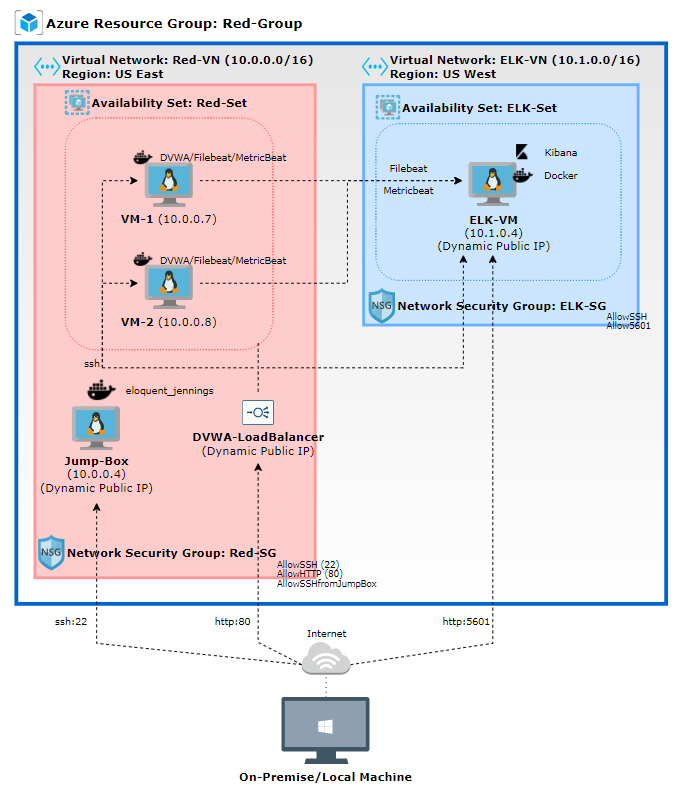

# Project 1: ELK Stack - Cloud-based SIEM

## Overview
This is a write-up for the Cybersecurity USYD Project 1. This Project was built to demonstrate a cloud-based solution utilizing the ELK stack to monitor two vulnerable web applications. 

The files in this repository were used to configure the network depicted below.



These files have been tested and used to generate a live ELK deployment on Azure. They can be used to either recreate the entire deployment pictured above. Alternatively, select portions of the Resources file may be used to install only certain pieces of it, such as Filebeat.

### Playbook 1: [ansible-config.yml](Resources/ansible-config.yml)
```
---
- name: Config Web VM with Docker
  hosts: webservers
  become: true
  tasks:
    - name: docker.io
      apt:
        update_cache: yes
        name: docker.io
        state: present

    - name: Install pip3
      apt:
        name: python3-pip
        state: present

    - name: Install Docker python module
      pip:
        name: docker
        state: present

    - name: download and launch a docker web container
      docker_container:
        name: dvwa
        image: cyberxsecurity/dvwa
        state: started
        restart_policy: always
        published_ports: 80:80

    - name: Enable docker service
      systemd:
        name: docker
        enabled: yes
```

### Playbook 2: [install-elk.yml](Resources/install-elk.yml)
```
---
- name: Configure Elk VM with Docker
  hosts: elk
  remote_user: azadmin
  become: true
  tasks:
    # Use apt module
    - name: Install docker.io
      apt:
        update_cache: yes
        name: docker.io
        state: present

      # Use apt module
    - name: Install pip3
      apt:
        force_apt_get: yes
        name: python3-pip
        state: present

      # Use pip module
    - name: Install Docker python module
      pip:
        name: docker
        state: present

      # Use sysctl module
    - name: Use more memory
      sysctl:
        name: vm.max_map_count
        value: "262144"
        state: present
        reload: yes

      # Use docker_container module
    - name: download and launch a docker elk container
      docker_container:
        name: elk
        image: sebp/elk:761
        state: started
        restart_policy: always
        published_ports:
          - 5601:5601
          - 9200:9200
          - 5044:5044

      # Use systemd module
    - name: Enable service docker on boot
      systemd:
        name: docker
        enabled: yes
```

### Playbook 3: [filebeat-playbook.yml](Resources/filebeat-playbook.yml)
```
---
- name: installing and launching filebeat
  hosts: webservers
  become: yes
  tasks:

  - name: download filebeat deb
    command: curl -L -O https://artifacts.elastic.co/downloads/beats/filebeat/filebeat-7.4.0-amd64.deb

  - name: install filebeat deb
    command: dpkg -i filebeat-7.4.0-amd64.deb

  - name: drop in filebeat.yml
    copy:
      src: /etc/ansible/files/filebeat-config.yml
      dest: /etc/filebeat/filebeat.yml

  - name: enable and configure system module
    command: filebeat modules enable system

  - name: setup filebeat
    command: filebeat setup

  - name: start filebeat service
    command: service filebeat start

  - name: enable service filebeat on boot
    systemd:
      name: filebeat
      enabled: yes
```


## Background
This document contains the following details:
- Description of the Topologu
- Access Policies
- ELK Configuration
..* Beats in Use
..* Machines Being Monitored
- How to Use the Ansible Build


## Description of the Topology

The main purpose of this network is to expose a load-balanced and monitored instance of DVWA, the D*mn Vulnerable Web Application.

Load balancing ensures that the application will be highly available, in addition to restricting access to the network.
> The aspect of security that load balancers are directed at is **redundancy**. In particular, protecting against DDoS attacks by shifting attack traffic.

What is the advantage of using a Jumpbox?
> there are a myriad of advantages of utilising a 'jumpbox'. Importantly, it helps create a security zone which can be used to configure multiple devices from one 'control' system. 

Integrating an ELK server allows users to easily monitor the vulnerable VMs for changes to the configuration and system files.

> **Filebeat** monitors the log files or locations which are specified, collects log events, and forwards them for indexing.
> **Metricbeat** acts to periodically collect 'metrics' from the operating system and from services that are running on the service. These metrics/statistics are then forwarded to be analysed. 

The configuration details of each machine may be found below.

| Name     | Function | IP Address | Operating System      |
|----------|----------|------------|-----------------------|
| Jump-Box | Gateway  | 10.0.0.4   | Linux (ubuntu 20.04)  |
| Web-1    |   DVWA   | 10.0.0.7   | Linux (ubuntu 20.04)  |
| Web-2    |   DVWA   | 10.0.0.8   | Linux (ubuntu 20.04)  |
| ELK-VM   |   ELK    | 10.1.0.4   | Linux (ubuntu 20.04)  |

*IP(s) presented are examples and may differ*

## Access Policies

The machines on the internal network are not exposed to the public Internet. 

Only the Jumpbox machine (Jump-Box) can accept connections (SSH) from the Internet. Access to this machine is only allowed from the On-Premise/Local Machine IP which was configured in the Network Security Group (Red-SG). 

Machines within the network can only be accessed by the Jump-Box Container.
> Additionally, the Jumpbox Container (10.0.0.4) can access the ELK VM using SSH. *Important to note - one must be attached to the Jump-Box docker container before attempting to access the ELK VM*  

A summary of the access policies in place can be found in the table below.

| Name     | Publicly Accessible | Allowed IP Addresses        |
|----------|---------------------|-----------------------------|
| Jump Box | Yes (SSH)           | On-Premise/Local Machine IP |
| Web-1    | No                  | 10.0.0.4 (Jump-Box)         |
| Web-2    | No                  | 10.0.0.4 (Jump-Box)         |
| ELK-VM   | No                  | 10.0.0.4 (Jump-Box)         |
| DVWA-LB  | No                  | On-Premise/Local Machine IP |


## Elk Configuration

Ansible was used to automate configuration of the ELK machine. No configuration was performed manually, which is advantageous because:
1. **Automation** - build/deploy quickly and efficiently. 
2. **Consistency** - allows for consistent system configurations/security measures ranging from small to large scale operations.
3. **Simple** - simplified processes allows for a range of individuals to implement/upgrade/understand the process and roling out of ELK monitoring solutions.

The [install-elk.yml](Resources/install-elk.yml) implements the following tasks:
1. Installs Docker
2. Installs Python
3. Installs Python Module for Docker
4. Increases Virtual Memory/Memory to support the ELK stack
5. Downloads & Launches the Docker ELK stack
6. Enables Docker on boot

The following screenshot displays the result of running `docker ps` after successfully configuring the ELK instance.


### Target Machines & Beats
This ELK server is configured to monitor the following machines:
1. Web-1 `10.0.0.7`
2. Web-2 `10.0.0.8`

We have installed the following Beats on these machines:
* Filebeat
* Metricbeat

These Beats allow us to collect the following information from each machine:
* Filebeat monitors changes to log files, file locations, and, log events.  
* Metricbeat obtains statistics from the operating system and services running on the server.

## Using the Playbook
In order to use the playbook, you will need to have an Ansible control node already configured. Assuming you have such a control node provisioned: 

SSH into the control node and follow the steps below:
- Copy the respective playbook file(s) to the Ansible Docker Container.
- Update the hosts file `/etc/ansible/hosts` to include:
```
[webservers]
10.0.0.7 ansible_python_interpreter=/usr/bin/python3
10.0.0.8 ansible_python_interpreter=/usr/bin/python3

[elk]
10.1.0.4 ansible_python_interpreter=/usr/bin/python3
```
- Run the playbook, and navigate to `http:/<ELK-VM-ip>:5601/app/kibana` to check that the installation worked as expected.

*VM IPs may differ*
